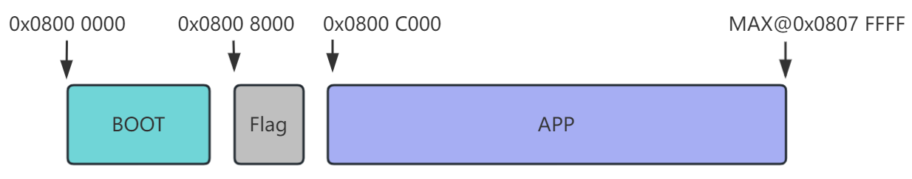
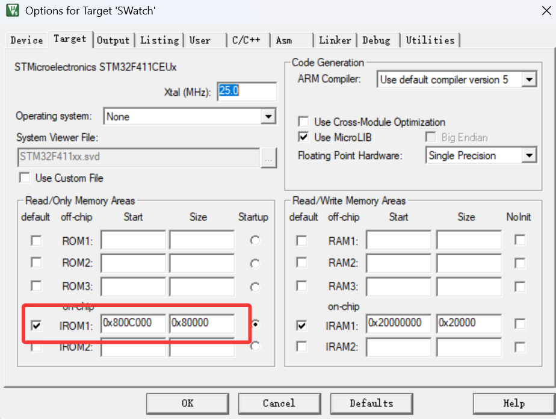
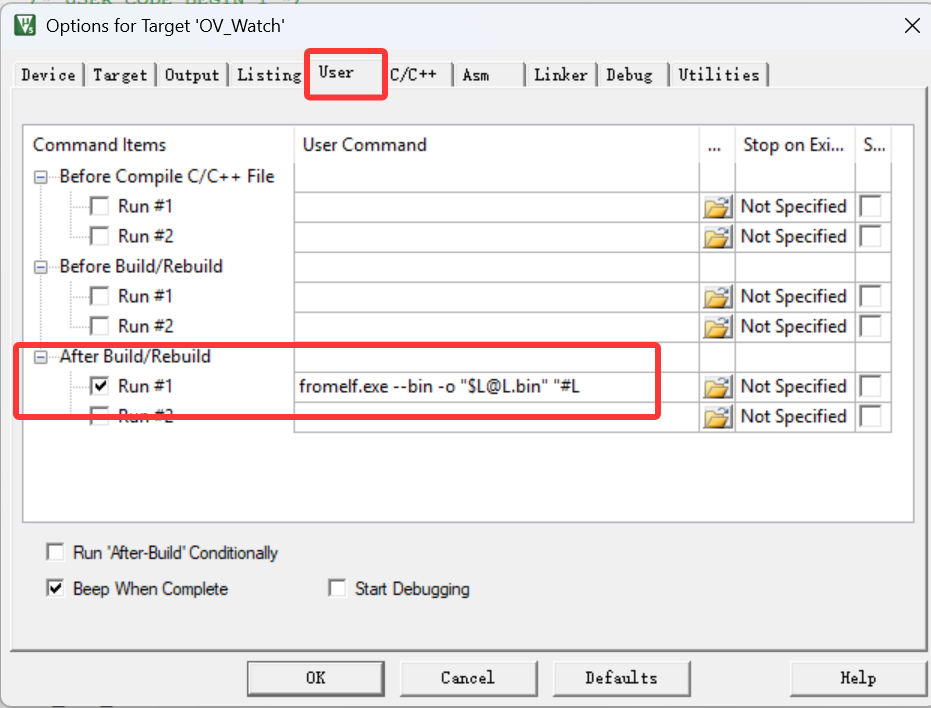
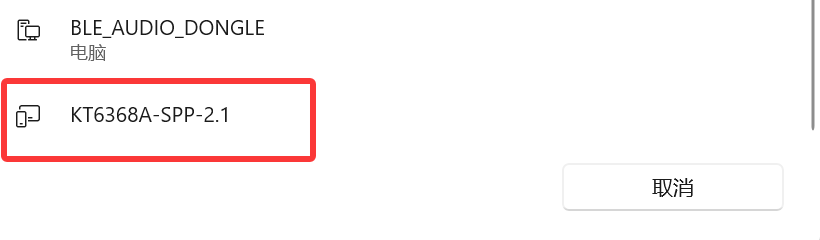
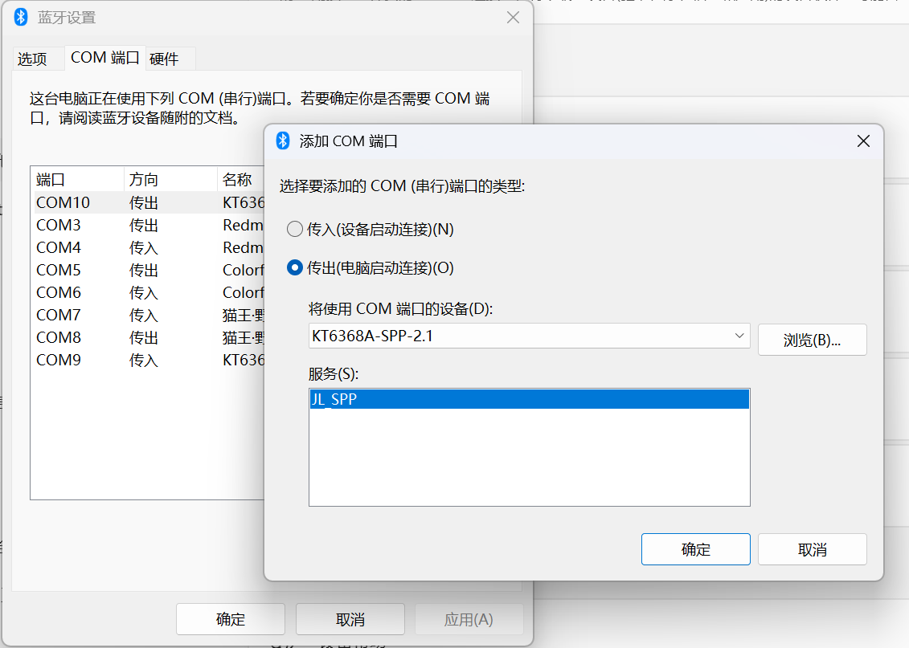
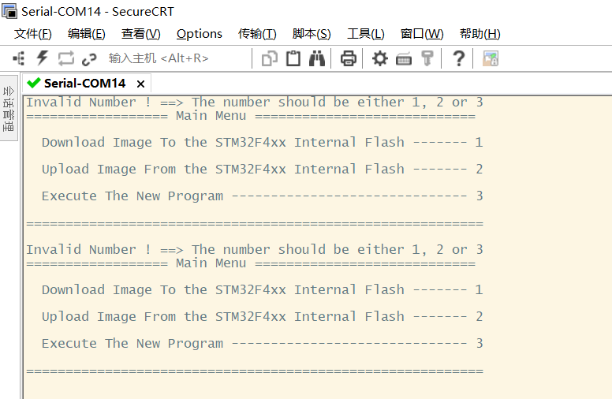
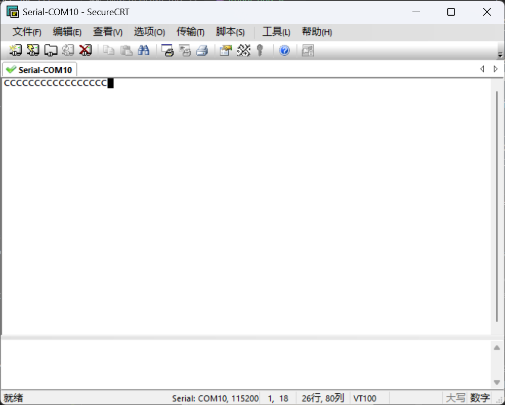
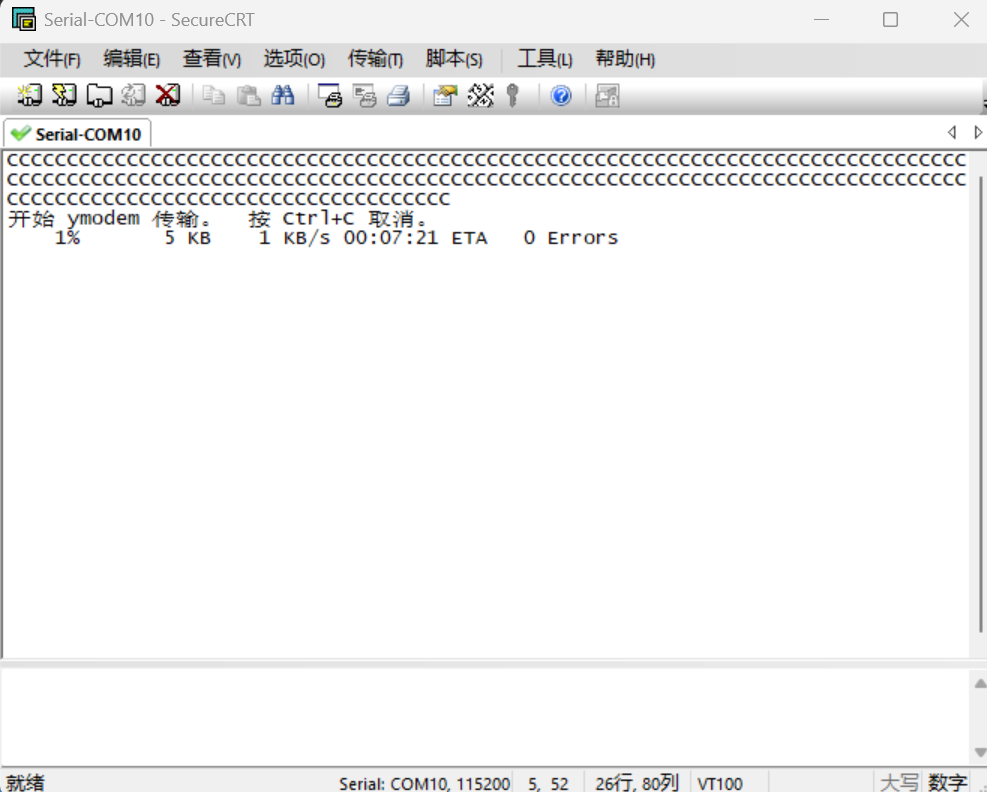
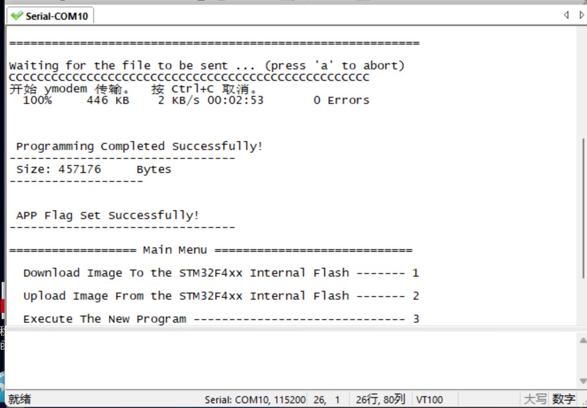
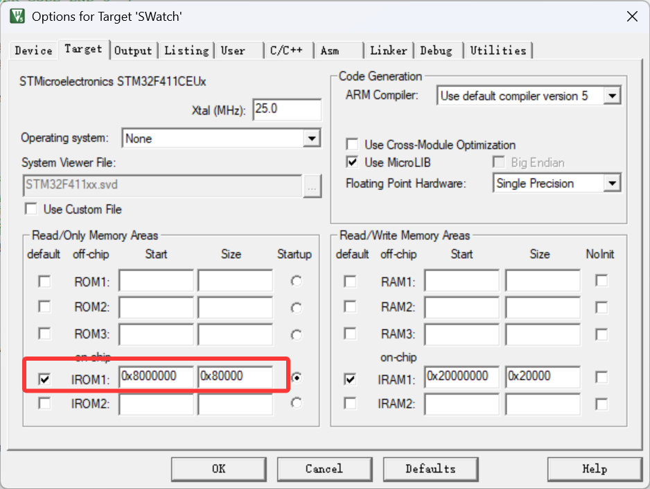

# README

一个多功能的智能手表，带有低功耗管理，多任务/页面管理等

## 烧录与配置说明

本项目采用 bootloader + FLAG + APP 三分区方式。以下步骤用于分别烧录 bootloader 与 APP，并保证冷启动/断电重启正常。

### 1) Flash 分区规划

- Bootloader: 0x08000000 ~ 0x08008000 (32 KB)
- FLAG: 0x08008000 ~ 0x0800C000 (16 KB, 存放 "APP FLAG")
- APP: 起始 0x0800C000

### 2) Keil 工程配置 (APP)

在 APP 工程中修改 IROM1:

- IROM1 Start: 0x0800C000
- IROM1 Size: 根据芯片 Flash 容量和 APP 预留空间设置 (本工程 Keil 默认: 0x00080000, 512 KB)

构建后，可在 map 文件中确认:

- LR_IROM1 (Base: 0x0800c000)

### 3) 代码修改 (APP)

APP 需要在开中断前设置向量表偏移:

- [SoftWare/Core/Src/main.c](SoftWare/Core/Src/main.c#L74-L90)

要点:

- SCB->VTOR = 0x0000C000U;
- 该值必须与 IROM1 Start 一致

### 4) 生成 APP 的 bin

建议流程:

- Keil -> Options for Target -> Output -> 勾选 Create HEX File

- 使用 Keil 自带 fromelf 或第三方工具将 hex 转为 bin 如：
- Keil -> Options for Target -> User -> After Build/ReBuild 勾选 Run #1, 命令填写:
	- fromelf.exe --bin -o "$L@L.bin" "#L"

这样之后编译就会输出.bin文件

校验 bin 头 8 字节:

- 第 1 个字: 初始 SP, 必须在 RAM 范围 (0x2000xxxx 或 0x2001xxxx)
- 第 2 个字: Reset_Handler, 必须在 APP 范围 (0x0800Cxxx)

若这两项不合法, bootloader 冷启动会判定"无 APP".

### 5) FLAG 规则 (bootloader 判定)

bootloader 会读取 0x08008000 起始的 8 字节, 组合为字符串 "APP FLAG"。
只有匹配成功才会跳转到 APP, 否则显示 "No App"。

因此升级完成后必须正确写入 FLAG 区域。

### 6) 烧录顺序

1. 先使用keil或STM32 ST-LINK Utility烧录 bootloader (bootloader.hex) 到 0x08000000
2. 再用SecureCRT烧录 APP (APP.bin) 到 0x0800C000

## OTA 升级流程 (SecureCRT)

以下为通过蓝牙 SPP + Ymodem 的无线升级流程。首次配置后，后续升级只需连接对应 COM 端口即可。

### A) 首次蓝牙配对与 COM 端口配置 (只需一次)

1. 在电脑蓝牙中搜索并配对设备
	- 设备名常见为 `KT6368A-SPP` 或类似名称
	- 以实际显示为准 (例如 `TD5322A`)

2. 打开“更多蓝牙设置”，将已配对设备添加为 COM 端口
	- 类型选择“传出 (电脑发起连接)”
	- 服务选择 `KT6368A-SPP`
	
3. 记录系统分配的 COM 号 (例如 `COM10`)

完成上述配置后，后续不需要重复设置。

前提:

- 设备 bootloader 已支持串口 Ymodem 升级
- 已生成 APP.bin

### B) 连接 SecureCRT 并进入升级菜单

步骤:

1. 使用 SecureCRT 连接设备串口
	- Serial 端口: 选择对应 COM
	- Baud Rate: 115200 (如有不同以设备为准)
	- Data Bits: 8, Parity: None, Stop Bits: 1, Flow Control: None
2. 设备进入升级模式
	- 上电时先按住 KEY1 然后再按住KEY2进入 bootloader 升级界面
	- 若未显示菜单, 可连续按 Enter
	
3. 在菜单中输入 `1` 进入 APP 传输
	- 终端持续显示 `C` 字符, 表示等待 Ymodem
	
### C) 发送 APP 文件 (Ymodem)

1. 在 SecureCRT 发送文件
	- 菜单: Transfer -> Send X/Y/Zmodem...(或者直接将bin文件拖入SecureCRT选择Ymodem即可)
	- Protocol: Ymodem
	- 选择文件: xxx.bin (或你的实际 APP.bin)

	
2. 等待传输完成
	- 传输结束后设备会校验并写入 APP
	- 若 bootloader 会自动写 FLAG, 直接重启即可
	- 这样就是传输成功了，可以进行下一步，否则需要重新传输
	

### D) 执行 APP

1. 在菜单中输入 `3` 执行 APP
2. 等待设备重启进入新固件

### E) 验证升级结果

1. 设备重启后进入新固件
	- 设备重启后进入新固件
	- 如仍提示 "No App", 需确认 FLAG 是否正确写入

### 7) 常见问题排查

- 断电后提示无 APP: 优先检查 IROM1 Start 与 SCB->VTOR 是否一致
- 能热启动但断电不行: 检查 bin 头 8 字节是否有效
- Ymodem 升级后不识别: 检查写入首地址是否为 0x0800C000, 且是否正确写入 "APP FLAG"

### 8) 仅调试 APP (不使用 bootloader)

当不需要 bootloader 分区, 只想单独调试 APP 时, 可按以下方式配置:

1. Keil 工程配置 (APP)
	- IROM1 Start: 0x08000000
	- IROM1 Size: 根据芯片 Flash 容量设置 (本工程 Keil 默认: 0x00080000, 512 KB)
	
2. 代码修改 (APP)
	- 若之前在 APP 中设置了 VTOR 偏移, 调试时需恢复为 0x00000000U (或 0x08000000U)
	- 示例位置: [SoftWare/Core/Src/main.c](SoftWare/Core/Src/main.c#L74-L90),直接注释掉此行代码即可

3. 下载方式
	- 直接将 APP 烧录到 0x08000000
	- 不需要写 FLAG, 也不依赖 bootloader 判定

4. 注意事项
	- 仅用于单独调试 APP, 量产或联调时需恢复三分区配置

